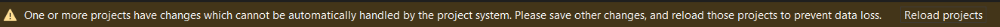
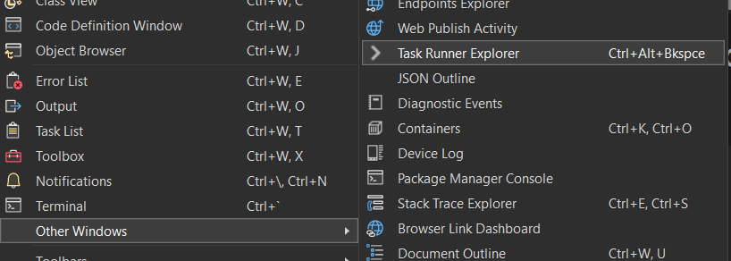
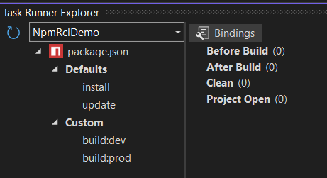
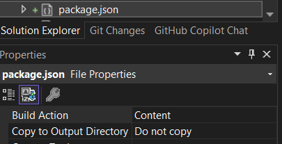

# Npm-Rcl-Demo

## Overview

This repository demonstrates how to create a Razor Class Library (RCL) project 
using NPM (Node Package Manager) for managing JavaScript dependencies. 
It includes a simple example of a Razor component that utilizes the azure-maps-control NPM
package.

NOTE: This demo will bundle the JavaScript code into a single file using 'webpack'.

## Prerequisites
- Visual Studio 2022 or later
- .NET 10.0 SDK or later
- [Azure Maps account](https://learn.microsoft.com/en-us/azure/azure-maps/quick-demo-map-app#create-an-azure-maps-account)
If you don't have an azure account, you can create a [free account](https://azure.microsoft.com/en-us/free/).
This demo uses a [Subscription Key](https://learn.microsoft.com/en-us/azure/azure-maps/quick-demo-map-app#get-the-subscription-key-for-your-account)

## Steps
### 1. Create a new RCL project
- Open Visual Studio and create a new Razor Class Library project.
- For the purposes of this example, we will name the project `NpmRclDemo`.

### 2. Add a Typescript JSON Configuration File `tsconfig.json` in the root of the project.
```json
{
  "compilerOptions": {
    "noImplicitAny": true,
    "noEmitOnError": true,
    "removeComments": false,
    "sourceMap": true,
    "outDir": "dist",
    "target": "ES6",
    "module": "ESNext",
    "moduleResolution": "bundler",
    "esModuleInterop": true
  },
  "files": [ "./scripts/index.ts" ],
  "compileOnSave": true,
  "exclude": [
    "node_modules",
    "wwwroot"
  ]
}
```
Although not required, you can install the Microsoft.TypeScript.MSBuild NuGet package.
The will include the 'node_modules' folder in the project and produce a 'dist' folder with the *.js output.
This is useful for debugging and testing the JavaScript code in the project.

NOTE: When installing the Microsoft.TypeScript.MSBuild NuGet package you may get an 'unhandled changes' notification. 

If you do get this notification then just save the changes and reload the project:


### 3. Add a Webpack Configuration File `webpack.config.js` in the root of the project.
```javascript
const path = require('path');

module.exports = {
    entry: './scripts/index.ts',
    module: {
        rules: [
            // all files with a `.ts`, `.cts`, `.mts` or `.tsx` extension will be handled by `ts-loader`
            {
                test: /\.([cm]?ts|tsx)$/,
                loader: "ts-loader",
                exclude: /node_modules/,
            }
        ],
    },
    resolve: {
        extensions: ['.tsx', '.ts', '.js'],
    },
    output: {
        filename: 'bundle.js',
        path: path.resolve(__dirname, 'wwwroot/dist'),
        library: 'azMaps'
    },
    externals: {
        "azure-maps-control": "atlas"
    }
};
```
- This configuration file tells Webpack to look for the entry point in `scripts/index.ts` and output the bundled file to `wwwroot/dist/bundle.js`.
- The `library` property is used to expose the `azMaps` variable to the global scope, so that it can be accessed from the Razor component.
- The '"azure-maps-control": "atlas"' entry tells webpack to use the `atlas` variable from the global scope instead of bundling it. 
- This is important because the `azure-maps-control` package is already included in the CDN and we don't want to bundle it again.

### 4. Add a package.json file in the root of the project.
```json
{
  "name": "npmrcldemo",
  "version": "1.0.0",
  "private": true,
  "scripts": {
    "build:dev": "webpack --mode=development",
    "build:prod": "webpack --mode=production"
  },
  "license": "MIT",
  "devDependencies": {
    "ts-loader": "^9.5.2",
    "typescript": "^5.8.3",
    "webpack": "^5.99.7",
    "webpack-cli": "^6.0.1"
  },
  "dependencies": {
    "azure-maps-control": "^3.6.1"
  }
}
```
- This file tells NPM to install the required packages and provides scripts to build the project in development and production mode.

### 5. Folder structure for the `NpmRclDemo` project.
- Create a folder named `scripts` in the root of the project. This folder will contain the TypeScript files.
  - For this project, we will create a 3 files in the 'scripts' folder:
    - `index.ts`: This file will be the entry point.
```typescript
export { Core } from './core';
```
   - `core.ts`: This file will contain a function to create the Azure map.
```typescript
import * as atlas from "azure-maps-control";
import { Security } from './security';

export class Core {
    private static maps: Map<string, atlas.Map> = new Map<string, atlas.Map>();

    public static addMap(
        mapId: string,
        auth: Security.Authentication): void {

        if (this.maps.has(mapId)) {
            console.error(`Map with ID ${mapId} already exists.`);
            return;
        }

        const map = new atlas.Map(mapId, {
            authOptions: {
                authType: auth.authType,
                subscriptionKey: auth.subscriptionKey,
                aadAppId: auth.aadAppId,
                aadTenant: auth.aadTenant,
                clientId: auth.clientId,
            },
            center: [-122.33, 47.6],
            zoom: 12,
            view: "Auto",
        });

        this.maps.set(mapId, map);
    }
}
```
   - `security.ts`: This file will export the Authentication interface that will be used for azure map security.
```typescript
import * as atlas from "azure-maps-control";

export namespace Security {
    export interface Authentication {
        authType: atlas.AuthenticationType;
        aadAppId: string;
        aadTenant: string;
        clientId: string;
        subscriptionKey: string;
    }
}
```
 - Create folder named 'Domain/Security' in the root of the project.
   - add `MapAuthentication.cs`: This file will contain C# code to manage the security information for the azure map.
```csharp
namespace NpmRclDemo.Domain.Security
{
    public enum MapAuthenticationType
    {
        SubscriptionKey,
        Aad,
    }

    public class MapAuthentication
    {
        public MapAuthenticationType AuthenticationType { get; set; }
        public string AuthType => AuthenticationType.ToAuthType();
        public string? SubscriptionKey { get; set; }
        public string? AadAppId { get; set; }
        public string? AadTenant { get; set; }
        public string? ClientId { get; set; }
    }

    internal static class MapAuthenticationExtensions
    {
        public static string ToAuthType(this MapAuthenticationType authenticationType)
        {
            return authenticationType switch
            {
                MapAuthenticationType.SubscriptionKey => "subscriptionKey",
                MapAuthenticationType.Aad => "aad",
                _ => throw new ArgumentOutOfRangeException(nameof(authenticationType), authenticationType, null)
            };
        }
    }
}

```
- Add the 'AzureMap.razor' Razor component to the project.
```razor
@inject IJSRuntime JSRuntime
@inject MapAuthentication MapAuthentication

<div id="@MapId" class="@Class" style="@Style"></div>

<style>
    .mapDiv {
        height: 400px;
        width: 400px;
    }
</style>

@code {
    [Parameter]
    public string? Class { get; set; } = "mapDiv";

    [Parameter]
    public string? MapId { get; set; }

    [Parameter]
    public string? Style { get; set; }

    protected override async Task OnAfterRenderAsync(bool firstRender)
    {
        if (firstRender)
        {
            await JSRuntime.InvokeVoidAsync("azMaps.Core.addMap", MapId, MapAuthentication);
        }
    }

    protected override void OnParametersSet()
    {
        if (string.IsNullOrWhiteSpace(MapId))
        {
            MapId = Guid.NewGuid().ToString();
        }
    }
}
```
### 6. Create the 'Sandbox' demo/client project.
- create a new Blazor Server App project and name it `Sandbox`.
- add a reference to the `NpmRclDemo` project.
- add the Azure Maps CDN references ('atlas.min.css', 'atlas.min.js') to the 'head' section and NpmRclDemo bundle.js to the 'body' section in the `App.razor` file.
```html
<!DOCTYPE html>
<html lang="en">

<head>
    <meta charset="utf-8" />
    <meta name="viewport" content="width=device-width, initial-scale=1.0" />
    <base href="/" />
    <link rel="stylesheet" href="@Assets["lib/bootstrap/dist/css/bootstrap.min.css"]" />
    <link rel="stylesheet" href="@Assets["app.css"]" />
    <link rel="stylesheet" href="@Assets["Sandbox.styles.css"]" />
    <link rel="stylesheet" href="https://atlas.microsoft.com/sdk/javascript/mapcontrol/3/atlas.min.css" type="text/css">
    <script src="https://atlas.microsoft.com/sdk/javascript/mapcontrol/3/atlas.min.js"></script>
    <ImportMap />
    <link rel="icon" type="image/png" href="favicon.png" />
    <HeadOutlet />
</head>

<body>
    <Routes />
    <ReconnectModal />
    <script src="@Assets["_framework/blazor.web.js"]"></script>
    <script src="./_content/NpmRclDemo/dist/bundle.js"></script>
</body>

</html>

```

- add the 'User Secrets' to the `Sandbox` project. This will be used to store the azure map subscription key.
```json
  "AzureMaps": {
    "AuthenticationType": "SubscriptionKey",
    "AadAppId": "",
    "AadTenant": "",
    "ClientId": "",
    "SubscriptionKey": "<your subscription key>"
  }
```
- add the 'MapAuthentication' in the `program.cs` file.
```csharp
//...etc.
var mapAuth = new MapAuthentication();
var mapSection = builder.Configuration.GetSection("AzureMaps");
mapSection.Bind(mapAuth);
builder.Services.AddSingleton(mapAuth);

var app = builder.Build();
```
- add the 'Pages/MapDemo.razor' page to the `Sandbox` project.
```razor
@page "/map-demo"
@rendermode InteractiveServer

<PageTitle>Map Demo</PageTitle>

<h3>Map Demo</h3>

<div style="height:400px;width:400px;">
    <AzureMap Class="azMap" />
</div>

<style>
    .azMap {
        height: 100%;
        width: 100%;
    }
</style>

@code {

}
```
- add the 'map-demo' menu item to the `NavMenu.razor` file.
```razor
        <div class="nav-item px-3">
            <NavLink class="nav-link" href="map-demo">
                <span class="bi bi-list-nested-nav-menu" aria-hidden="true"></span> Map Demo
            </NavLink>
        </div>
```

## 7. Configure the build process.
- Manually add the `pre-build` event for webpack in the `NpmRclDemo` project file.
```xml
  <Target Name="PreBuild" BeforeTargets="PreBuildEvent">
    <Exec Command="call npm install" />
    <Exec Command="call npm run build:prod" />
  </Target>
```
This will run the `npm install` and `npm run build:prod` commands before the project is built.
Which will install the required NPM packages and bundle the *.js typescript output using Webpack.

NOTE: For debugging purposes, you can also manually trigger this process using the 'Task Runner Explorer' in Visual Studio.





## 8. Run the project.
- Set the `Sandbox` project as the startup project and run the project.

## Recommendations:
- Change the `tsconfig.json`, and `package.json` 'Copy to Output Directory' property to `Do not copy`



## NuGet Package
- You can publish the `NpmRclDemo` project as a NuGet package if desired.
