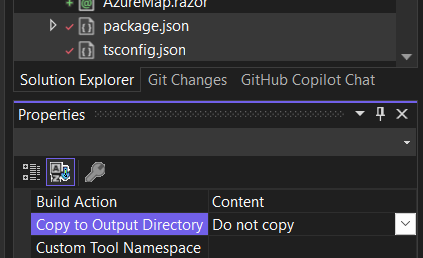

# Npm-Rcl-Demo

## Steps to Create a New RCL Project with NPM
### 1. Create a new RCL project
### 2. Add a tsconfig.json file
- Add a Typescript JSON Configuration File named `tsconfig.json` in the root of the project.

- Update the `tsconfig.json` file:
```json
{
  "compilerOptions": {
    "noImplicitAny": false,
    "noEmitOnError": true,
    "removeComments": false,
    "sourceMap": true,
    "target": "ESNext",
    "outDir": "dist",
    "module": "ESNext",
    "moduleResolution": "node"
  },
  "exclude": [
    "node_modules",
    "wwwroot"
  ],
  "include": [
    "scripts/**/*"
  ]
}
```
### 3. Add a package.json file
- Add a `package.json` file in the root of the project.

- Update the `package.json` file:
```json
{
  "version": "1.0.0",
  "name": "npm-rcl-demo",
  "private": true,
  "devDependencies": {
    "css-loader": "7.1.2",
    "style-loader": "4.0.0",
    "webpack": "5.99.6",
    "webpack-cli": "6.0.1"
  },
  "scripts": {
    "build": "webpack"
  }
}
```
### 4. Add a webpack.config.js file
- Add a `webpack.config.js` file in the root of the project.
- Update the `webpack.config.js` file:
```javascript
const path = require('path');

module.exports = {
    entry: './dist/index.js',
    mode: "production",
    output: {
        path: path.resolve(__dirname, 'wwwroot/dist'),
        filename: 'npm-rcl-demo.js',
    },
    module: {
        rules: [
            {
                test: /\.css$/i,
                use: ["style-loader", "css-loader"]
            }
        ],
    }
};
```
### 5. Add a 'scripts' folder
- Add a `scripts` folder in the root of the project.
- Add an `index.ts` file in the `scripts` folder.
- Update the `index.ts` file:
```typescript
console.log('Hello from NpmRclDemo!');
```

### 6. Install Current Dependencies
- Open up the Task Runner Explorer in Visual Studio and run the `npm install` task to install the dependencies.


## Steps to Build the Project
### 1. Build the Project in Visual Studio
### 2. Open the Task Runner Explorer in Visual Studio and run the `npm build` task to build the project.


## You should now see the following folder/file structure:


## Suggestions:
- Change the tsconfig.json, package.json, and webpack.config.js files to `Do not copy` (not required for distributiion)
- 

## Additional Steps:
### 1. Add more NPM packages specific to your needs.
### 2. Add the required *.ts files to the `scripts` folder.
### 3. Repeat the Install/Build tasks to incorporate the new packages.

## Updating the NPM packages:
### 1. Open the Task Runner Explorer in Visual Studio and run the `npm update` task.
